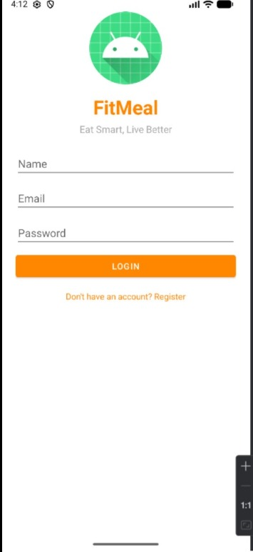
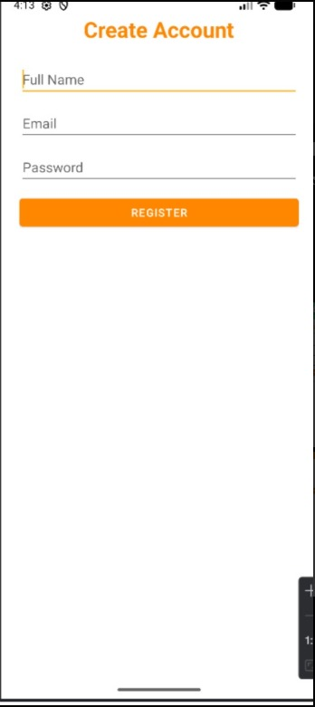
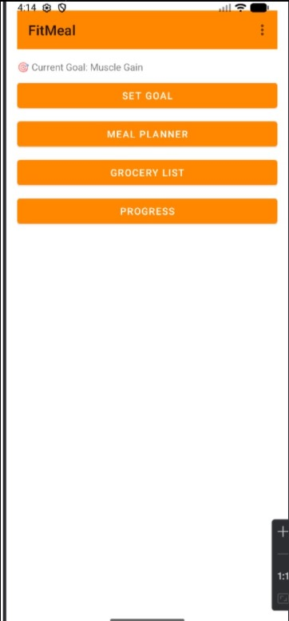
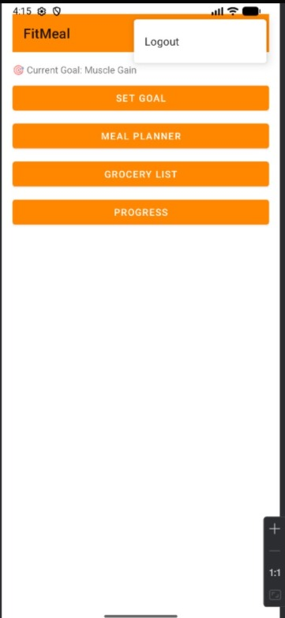
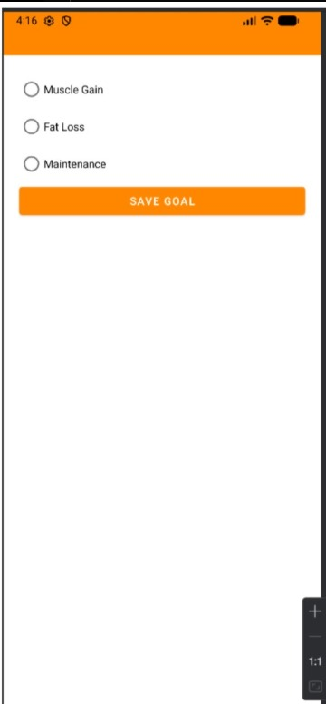
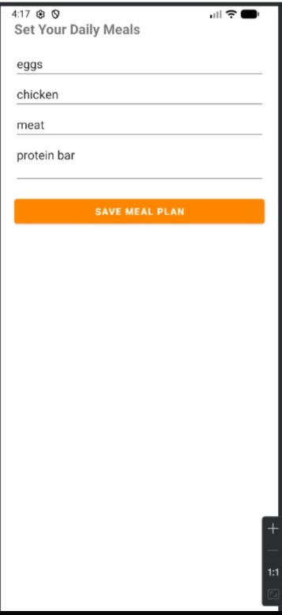
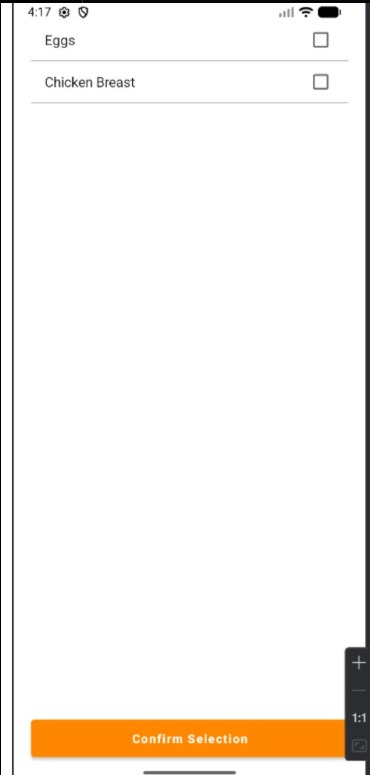

# FitMeal 🍎

FitMeal is an Android nutrition and fitness management application designed to help users achieve their health goals through personalized meal planning, grocery management, and progress tracking.

## Features

- 🔐 User Login and Registration
- 🎯 Fitness Goal Selection
  - Muscle Gain
  - Fat Loss
  - Maintenance
- 🍽️ Personalized Meal Planner
- 🛒 Grocery List Management
- 📊 Nutrition and Progress Tracking
- 💪 Daily Meal Management

## Screenshots

### Login & Registration

### Dashboard

### Goal Setting

### Meal Planner

### Grocery List

### Progress Tracking

## Technologies Used

- Kotlin
- Android Studio
- Jetpack Components
- XML Layouts
- Gradle

## Project Structure
FitMeal
│
├── app
├── screenshots
├── gradle
├── build.gradle.kts
└── settings.gradle.kts

## Author
Mohammed Khalid Abusafieh
